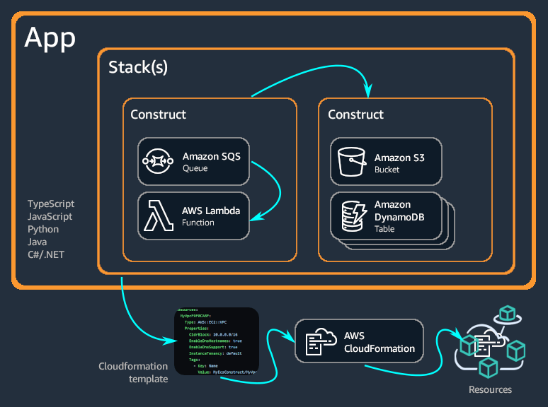

Guide to AWS-CDK v2
reusable code-> construct-> stack/app

docs-> https://docs.aws.amazon.com/cdk/v2/guide/home.html
official cdk construct library-> https://docs.aws.amazon.com/cdk/api/v2/docs/aws-construct-library.html
                                 https://constructs.dev/search?q=&cdk=aws-cdk&cdkver=2&sort=downloadsDesc&offset=0
                                 https://github.com/aws-samples/aws-cdk-examples
                                 
npm i -g aws-cdk
cdk init sample-app --language=xyz
source .venv/bin/activate
python -m pip install -r requirements.txt
mvn package
cdk ls
cdk docs
cdk bootstrap
cdk synth
cdk diff
cdk deploy

